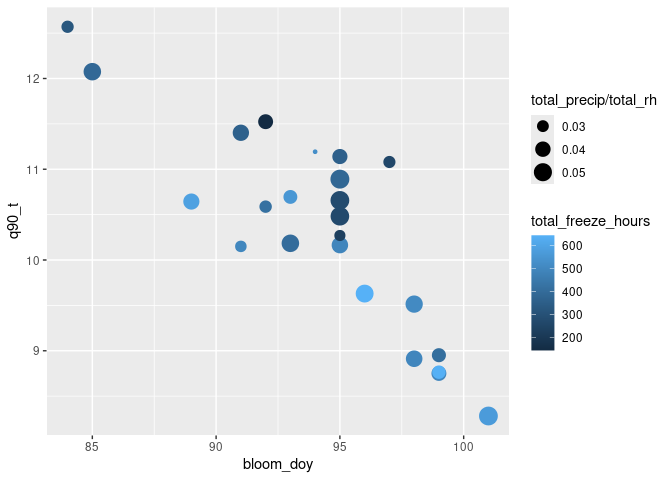
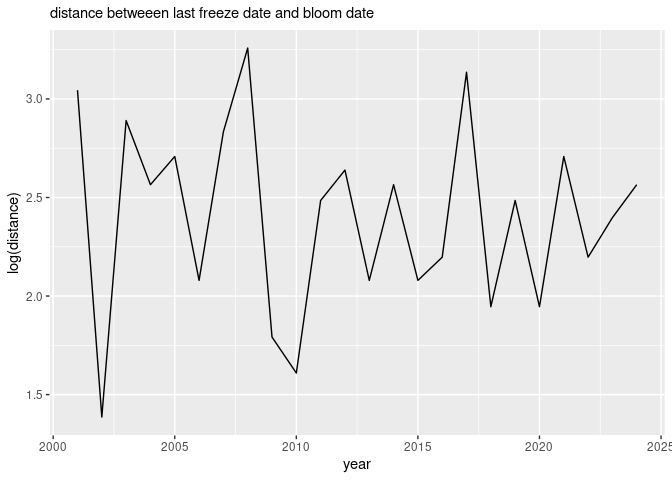
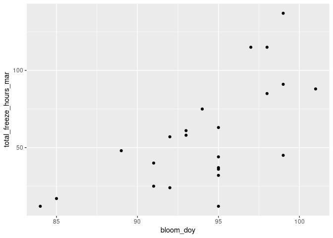
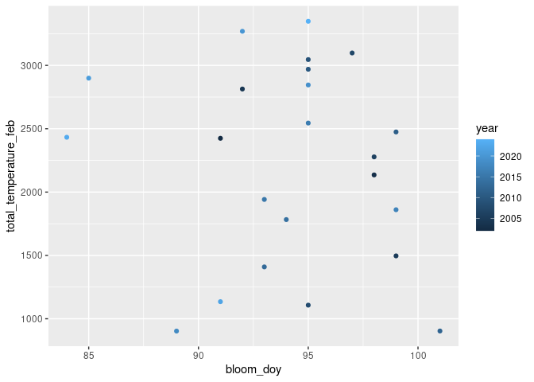
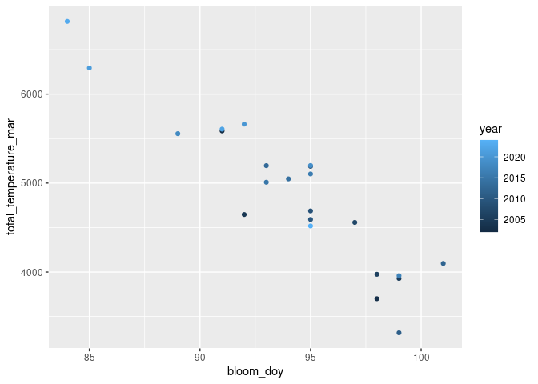
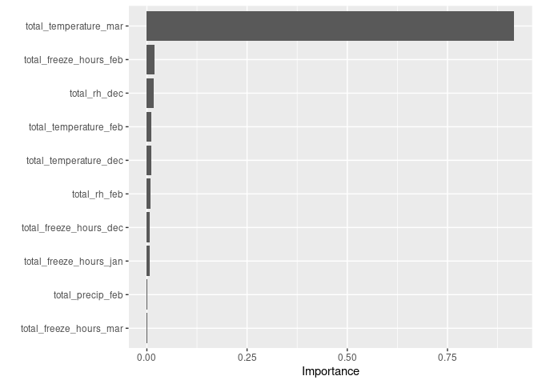

# cherry-blossom-bloom


``` r
raw_kyoto <- "https://raw.githubusercontent.com/GMU-CherryBlossomCompetition/peak-bloom-prediction/refs/heads/main/data/kyoto.csv"

kyoto_df <- data.table::fread(raw_kyoto)
```

``` r
# library(tidygeocoder)
library(nasapower)
library(dplyr)
```


    Attaching package: 'dplyr'

    The following objects are masked from 'package:stats':

        filter, lag

    The following objects are masked from 'package:base':

        intersect, setdiff, setequal, union

``` r
library(ggplot2)

# locations <- unique(kyoto_df$location)

# lat/lon already in kyoto df. 
# loc_df <- data.frame(
#   location = locations
# ) |>
#   dplyr::mutate(
#     ID = dplyr::row_number()
#   )
# 
# loc_df <- loc_df |> 
#  tidygeocoder::geocode(location)
kyoto_info <- kyoto_df |> head(1)

weather_df <- nasapower::get_power(community = "ag", 
                                   pars = c("T2M", "RH2M", "PRECTOTCORR"),
                                   temporal_api = "hourly", 
                                   lonlat = c(kyoto_info$long, kyoto_info$lat),
                                   dates = c("2001-01-01", "2024-07-01")
                                   )
```

### kyoto temperature and cherry blossom eda take 2 (jan-march aggregates)

can the winter season + march predict the bloom. (naive-trick to avoid
needing an accurate weather extension into march-april). try to capture
dormancy of blossoms.

``` r
#library(slider)

weather_metrics_df <- weather_df |>
                      dplyr::mutate(
                        freeze = ifelse(T2M < 0, 1, 0)
                      ) |>
                      # 1 to 3 (jan - mar)
                      dplyr::filter(MO <= 3) |>
                      dplyr::group_by(YEAR) |>
                      summarize(
                        total_freeze_hours = sum(freeze),
                        total_temperature  = sum(T2M),
                        q70_t              = quantile(T2M, .7),
                        q90_t              = quantile(T2M, .9),
                        total_precip       = sum(PRECTOTCORR),
                        total_rh           = sum(RH2M)
                      ) |>
                      janitor::clean_names()


kyoto_df |>
  dplyr::mutate(
    bloom_date = as.Date(bloom_date)
  ) |>
  dplyr::left_join(weather_metrics_df, by = 'year') |>
  dplyr::select(-c(lat, long, alt)) |> 
  na.omit() |>
  corrr::correlate() |>
  corrr::fashion() |>
  gt::gt() |>
  gt::as_raw_html()
```

    Non-numeric variables removed from input: `location`, and `bloom_date`
    Correlation computed with
    • Method: 'pearson'
    • Missing treated using: 'pairwise.complete.obs'

<div id="hbihwmyrkc" style="padding-left:0px;padding-right:0px;padding-top:10px;padding-bottom:10px;overflow-x:auto;overflow-y:auto;width:auto;height:auto;">
  &#10;  

| term | year | bloom_doy | total_freeze_hours | total_temperature | q70_t | q90_t | total_precip | total_rh |
|:--:|:--:|:--:|:--:|:--:|:--:|:--:|:--:|:--:|
| year |  | -.48 | -.36 | .44 | .49 | .40 | -.19 | -.34 |
| bloom_doy | -.48 |  | .26 | -.59 | -.69 | -.84 | .18 | .37 |
| total_freeze_hours | -.36 | .26 |  | -.90 | -.83 | -.55 | .05 | .23 |
| total_temperature | .44 | -.59 | -.90 |  | .98 | .84 | -.10 | -.33 |
| q70_t | .49 | -.69 | -.83 | .98 |  | .87 | -.10 | -.38 |
| q90_t | .40 | -.84 | -.55 | .84 | .87 |  | -.22 | -.46 |
| total_precip | -.19 | .18 | .05 | -.10 | -.10 | -.22 |  | .72 |
| total_rh | -.34 | .37 | .23 | -.33 | -.38 | -.46 | .72 |  |

</div>

``` r
kyoto_df |>
  dplyr::mutate(
    bloom_date = as.Date(bloom_date)
  ) |>
  dplyr::left_join(weather_metrics_df, by = 'year') |>
  na.omit() |>
    ggplot() +
  geom_point(aes(x = bloom_doy, 
                 y = q90_t, 
                 color = total_freeze_hours, 
                 size = total_precip/total_rh))
```



``` r
last_freeze_df <- 
weather_df |>
    dplyr::mutate(
        freeze = ifelse(T2M < 0, 1, 0)
    ) |>
    dplyr::filter(MO <= 3) |>
    dplyr::group_by(YEAR) |> 
    dplyr::filter(freeze == 1) |> 
    slice_tail(n = 1) |>
    dplyr::mutate(
      freeze_date = lubridate::make_date(YEAR, MO, DY)
    ) |>
  janitor::clean_names() |>
  dplyr::select(year, freeze_date)


kyoto_df |>
  dplyr::mutate(
    bloom_date = as.Date(bloom_date)
  ) |>
  dplyr::left_join(last_freeze_df, by = 'year') |>
  na.omit() |>
  dplyr::mutate(
    distance = as.numeric(bloom_date - freeze_date)
  ) |>
  ggplot() +
  geom_line(aes(x = year, y = log(distance))) +
  labs(subtitle = "distance betweeen last freeze date and bloom date")
```



### modeling data checkpoint

``` r
modeling_data <- kyoto_df |>
                 dplyr::select(alt, year, bloom_doy, bloom_date)|>
                 dplyr::left_join(weather_metrics_df, by = 'year') |>
                 dplyr::left_join(last_freeze_df, by = 'year') |>
                 na.omit() |>
                 dplyr::mutate(
                   bloom_date       = as.Date(bloom_date),
                   days_from_freeze = log(as.numeric(bloom_date - freeze_date))
                ) |>
                dplyr::select(-bloom_date, -freeze_date)
```

### training

``` r
library(rsample)
library(recipes)
```


    Attaching package: 'recipes'

    The following object is masked from 'package:stats':

        step

``` r
library(parsnip)
library(workflows)
library(finetune)
```

    Loading required package: tune

``` r
library(yardstick)

# split ------------------------------
time_split <- initial_time_split(modeling_data, prop = .85)

training <- training(time_split)
testing  <- testing(time_split)

folds <- rsample::vfold_cv(training, v = 10, strata = bloom_doy)
```

    Warning: The number of observations in each quantile is below the recommended threshold of 20.
    • Stratification will use 1 breaks instead.

    Warning: Too little data to stratify.
    • Resampling will be unstratified.

``` r
# recipe ------------------------------
bloom_recipe <- 
    recipes::recipe(bloom_doy ~ ., training) |>
    recipes::step_mutate(
      cross_fx_1 = q90_t / total_freeze_hours,
      cross_fx_2 = total_temperature / total_freeze_hours,
      cross_fx_3 = total_freeze_hours^2 / alt
    ) |>
    recipes::step_rm(tidyr::any_of(!!c("alt"))) |>
    recipes::step_zv(all_nominal_predictors()) |>
    recipes::step_dummy(all_nominal_predictors()) |>
    recipes::step_normalize(all_nominal_predictors())


# engine spec --------------------------

library(rules)
library(Cubist)
```

    Loading required package: lattice

``` r
cub_grid <- expand.grid(
  committees      = c(30, 45, 55, 80),
  neighbors       = c(3, 5, 9),
  max_rules       = c(15, 30, 45, 70)
)

cub_spec <- cubist_rules(
  committees = tune(),
  neighbors  = tune(),
  max_rules  = tune()) |>
  # quinlan's cubist 
  set_engine("Cubist") |> 
  set_mode("regression")


# tune ---------------------------------

cub_results <-
  finetune::tune_race_anova(
    workflow() |>
      add_recipe(bloom_recipe) |>
      add_model(cub_spec),
    resamples = folds,
    grid = cub_grid,
    control = control_race(),
    metrics = metric_set(yardstick::rmse)
  )

# final fit ---------------------------
# select_best(cub_results)
# cub_fit$fit$fit$fit$coefficients

cub_fit <- 
  fit(
    finalize_workflow(
      workflow() |>
      add_recipe(bloom_recipe) |>
      add_model(cub_spec), 
      select_best(cub_results)
      ), 
    training
  )
```

    Warning in select_best(cub_results): No value of `metric` was given; "rmse"
    will be used.

### testing

``` r
preds <- predict(cub_fit, testing)

testing |>
  bind_cols(preds) |>
  select(year, bloom_doy, .pred) |> 
  gt::gt() |>
  gt::as_raw_html()
```

<div id="djgunazwhb" style="padding-left:0px;padding-right:0px;padding-top:10px;padding-bottom:10px;overflow-x:auto;overflow-y:auto;width:auto;height:auto;">
  &#10;  

| year | bloom_doy |    .pred |
|-----:|----------:|---------:|
| 2021 |        85 | 90.87174 |
| 2022 |        91 | 94.46640 |
| 2023 |        84 | 89.75625 |
| 2024 |        95 | 94.50384 |

</div>

use testing to create upper/lower intervals.

``` r
conf_int <- probably::int_conformal_split(cub_fit, cal_data = testing)

# interval check
predict(conf_int, testing, level = .5)
```

    # A tibble: 4 × 3
      .pred .pred_lower .pred_upper
      <dbl>       <dbl>       <dbl>
    1  90.9        85.1        96.6
    2  94.5        88.7       100. 
    3  89.8        84          95.5
    4  94.5        88.7       100. 

## kyoto temperature and cherry blossom eda take 3 (monthly method)

``` r
weather_metrics_monthly_df <- weather_df |>
                      # 2024-2-18 idea for capturing december and the 'winter' year
                      dplyr::mutate(
                        MO   = ifelse(MO == 12, 0, MO),
                        YEAR = ifelse(MO == 0, YEAR +1, YEAR)
                      ) |>
                      dplyr::mutate(
                        freeze = ifelse(T2M < 0, 1, 0)
                      ) |>
                      # 1 to 3 (jan - mar)
                      dplyr::filter(MO <= 3) |>
                      # year and month
                      dplyr::group_by(YEAR, MO) |>
                      summarize(
                        total_freeze_hours = sum(freeze),
                        total_temperature  = sum(T2M),
                        q10_t              = quantile(T2M, .1),
                        q30_t              = quantile(T2M, .3),
                        q70_t              = quantile(T2M, .7),
                        q90_t              = quantile(T2M, .9),
                        # max_t              = max(T2M),
                        total_precip       = sum(PRECTOTCORR),
                        total_rh           = sum(RH2M)
                      ) |>
                      janitor::clean_names()
```

    `summarise()` has grouped output by 'YEAR'. You can override using the
    `.groups` argument.

``` r
wide_weather_metrics_monthly_df <- weather_metrics_monthly_df |>
                                   dplyr::ungroup() |> 
                                   dplyr::mutate(
                                    month_id = case_when(mo == 0 ~ 'dec', 
                                                         mo == 1 ~ 'jan', 
                                                         mo == 2 ~ 'feb', 
                                                         mo == 3 ~ 'mar')
                                   ) |>
                                    # maybe an accelerated oblique forest could handle these 
                                    dplyr::select(-mo, -q10_t, -q30_t, -q70_t, -q90_t) |>
                                    tidyr::pivot_wider(
                                     id_cols = year,
                                     names_from = month_id,
                                     values_from = c(total_freeze_hours, total_temperature,
                                                     total_precip, total_rh),
                                     names_glue = "{.value}_{month_id}"
                                     ) 

kyoto_df |>
  dplyr::mutate(
    mo         = lubridate::month(bloom_date),
    bloom_date = as.Date(bloom_date)
  ) |>
  dplyr::left_join(wide_weather_metrics_monthly_df, by = c('year')) |>
  dplyr::select(-c(lat, long, alt)) |> 
  na.omit() |>
  corrr::correlate() |>
  corrr::fashion() |>
  gt::gt() |>
  gt::as_raw_html()
```

    Non-numeric variables removed from input: `location`, and `bloom_date`
    Correlation computed with
    • Method: 'pearson'
    • Missing treated using: 'pairwise.complete.obs'

<div id="fajqbwlxey" style="padding-left:0px;padding-right:0px;padding-top:10px;padding-bottom:10px;overflow-x:auto;overflow-y:auto;width:auto;height:auto;">
  &#10;  

| term | year | bloom_doy | mo | total_freeze_hours_jan | total_freeze_hours_feb | total_freeze_hours_mar | total_freeze_hours_dec | total_temperature_jan | total_temperature_feb | total_temperature_mar | total_temperature_dec | total_precip_jan | total_precip_feb | total_precip_mar | total_precip_dec | total_rh_jan | total_rh_feb | total_rh_mar | total_rh_dec |
|:--:|:--:|:--:|:--:|:--:|:--:|:--:|:--:|:--:|:--:|:--:|:--:|:--:|:--:|:--:|:--:|:--:|:--:|:--:|:--:|
| year |  | -.48 | -.45 | -.17 | -.10 | -.47 | -.01 | .22 | .06 | .54 | .15 | -.14 | -.25 | .07 | -.22 | -.47 | -.24 | -.02 | -.68 |
| bloom_doy | -.48 |  | .75 | .06 | .07 | .67 | .01 | -.19 | -.13 | -.92 | .18 | -.09 | .57 | -.05 | .40 | .14 | .47 | .21 | .51 |
| mo | -.45 | .75 |  | -.17 | -.11 | .36 | -.11 | .10 | .07 | -.63 | .22 | -.08 | .39 | -.23 | .37 | .12 | .42 | -.02 | .54 |
| total_freeze_hours_jan | -.17 | .06 | -.17 |  | .53 | .34 | .52 | -.92 | -.51 | -.26 | -.50 | -.04 | .06 | -.01 | .21 | .12 | -.17 | .15 | .14 |
| total_freeze_hours_feb | -.10 | .07 | -.11 | .53 |  | .10 | .18 | -.59 | -.95 | -.02 | -.34 | -.07 | -.05 | .06 | .23 | .14 | -.02 | .47 | .08 |
| total_freeze_hours_mar | -.47 | .67 | .36 | .34 | .10 |  | .26 | -.43 | -.14 | -.79 | -.14 | -.16 | .22 | -.11 | .34 | .02 | .15 | -.03 | .36 |
| total_freeze_hours_dec | -.01 | .01 | -.11 | .52 | .18 | .26 |  | -.47 | -.21 | -.12 | -.88 | -.01 | .15 | .10 | .21 | -.03 | -.12 | -.03 | -.10 |
| total_temperature_jan | .22 | -.19 | .10 | -.92 | -.59 | -.43 | -.47 |  | .58 | .36 | .40 | .14 | -.07 | .05 | -.34 | -.13 | .16 | -.25 | -.27 |
| total_temperature_feb | .06 | -.13 | .07 | -.51 | -.95 | -.14 | -.21 | .58 |  | .05 | .33 | -.00 | .12 | .04 | -.36 | -.16 | .05 | -.39 | -.09 |
| total_temperature_mar | .54 | -.92 | -.63 | -.26 | -.02 | -.79 | -.12 | .36 | .05 |  | -.08 | .06 | -.53 | -.01 | -.36 | -.15 | -.37 | -.15 | -.52 |
| total_temperature_dec | .15 | .18 | .22 | -.50 | -.34 | -.14 | -.88 | .40 | .33 | -.08 |  | -.12 | .12 | -.15 | -.06 | -.08 | .22 | .04 | .11 |
| total_precip_jan | -.14 | -.09 | -.08 | -.04 | -.07 | -.16 | -.01 | .14 | -.00 | .06 | -.12 |  | .07 | .30 | .05 | .57 | .17 | .15 | -.05 |
| total_precip_feb | -.25 | .57 | .39 | .06 | -.05 | .22 | .15 | -.07 | .12 | -.53 | .12 | .07 |  | .37 | .10 | .30 | .67 | .46 | .32 |
| total_precip_mar | .07 | -.05 | -.23 | -.01 | .06 | -.11 | .10 | .05 | .04 | -.01 | -.15 | .30 | .37 |  | -.39 | .37 | .33 | .62 | -.11 |
| total_precip_dec | -.22 | .40 | .37 | .21 | .23 | .34 | .21 | -.34 | -.36 | -.36 | -.06 | .05 | .10 | -.39 |  | .24 | .02 | .12 | .54 |
| total_rh_jan | -.47 | .14 | .12 | .12 | .14 | .02 | -.03 | -.13 | -.16 | -.15 | -.08 | .57 | .30 | .37 | .24 |  | .59 | .44 | .54 |
| total_rh_feb | -.24 | .47 | .42 | -.17 | -.02 | .15 | -.12 | .16 | .05 | -.37 | .22 | .17 | .67 | .33 | .02 | .59 |  | .39 | .41 |
| total_rh_mar | -.02 | .21 | -.02 | .15 | .47 | -.03 | -.03 | -.25 | -.39 | -.15 | .04 | .15 | .46 | .62 | .12 | .44 | .39 |  | .18 |
| total_rh_dec | -.68 | .51 | .54 | .14 | .08 | .36 | -.10 | -.27 | -.09 | -.52 | .11 | -.05 | .32 | -.11 | .54 | .54 | .41 | .18 |  |

</div>

### wide modeling data checkpoint

``` r
wide_modeling_data <- 
  kyoto_df |>
  dplyr::mutate(
    bloom_date = as.Date(bloom_date)
  ) |>
  dplyr::left_join(wide_weather_metrics_monthly_df, by = c('year')) |>
  dplyr::select(-c(lat, long, alt, 
                   bloom_date, location)) |> 
  na.omit() 
```

``` r
wide_modeling_data |> 
  ggplot() + 
  geom_point(aes(x = bloom_doy, y = total_freeze_hours_mar))
```



``` r
wide_modeling_data |> 
  ggplot() + 
  geom_point(aes(x = bloom_doy, y = total_temperature_feb, color = year))
```



it’s like a perfect line (total temperature in march and bloom date):

``` r
wide_modeling_data |> 
  ggplot() + 
  geom_point(aes(x = bloom_doy, y = total_temperature_mar, color = year))
```



### training (wide)

``` r
library(rsample)
library(recipes)
library(parsnip)
library(workflows)
library(finetune)
library(yardstick)

# split ------------------------------
w_time_split <- initial_time_split(wide_modeling_data, prop = .87)

w_training <- training(w_time_split)
w_testing  <- testing(w_time_split)

w_folds <- rsample::vfold_cv(w_training, v = 10)

# recipe ------------------------------
w_bloom_recipe <- 
    recipes::recipe(bloom_doy ~ ., w_training) |>
    recipes::step_rm(tidyr::any_of(!!c("alt"))) |>
    recipes::step_mutate(
      accelerator = year^3
    ) |> 
    recipes::step_rm(tidyr::any_of(!!c("year"))) |>
    recipes::step_zv(all_nominal_predictors()) |>
    recipes::step_dummy(all_nominal_predictors()) |>
    recipes::step_normalize(all_nominal_predictors())


# engine spec --------------------------

xgb_grid <- expand.grid(
  trees      = c(100, 300, 400),
  tree_depth = c(9),
  learn_rate = c(.5, .7),
  mtry       = c(15, 20, 25, 30),
  loss_reduction = c(0, .01, .1)
)

xgb_spec <- boost_tree(
  trees          = tune(),
  tree_depth     = tune(),
  learn_rate     = tune(),
  mtry           = tune(),
  loss_reduction = tune()) |>
  # boosted xgbm model
  set_engine("xgboost", nthread = 6) |> 
  set_mode("regression")

xgb_results <-
  finetune::tune_race_anova(
    workflow() |>
      add_recipe(w_bloom_recipe) |>
      add_model(xgb_spec),
    resamples = w_folds,
    grid = xgb_grid,
    control = control_race(),
    metrics = metric_set(yardstick::rmse)
  )


# final fit ---------------------------

xgb_fit <- 
  fit(
    finalize_workflow(
      workflow() |>
      add_recipe(w_bloom_recipe) |>
      add_model(xgb_spec), 
      select_best(xgb_results)
      ), 
    w_training
  )
```

    Warning in select_best(xgb_results): No value of `metric` was given; "rmse"
    will be used.

``` r
vip::vip(xgb_fit)
```



### testing

``` r
w_preds <- predict(xgb_fit, w_testing)

w_testing |>
  bind_cols(w_preds) |>
  select(year, bloom_doy, .pred) |> 
  gt::gt() |>
  gt::as_raw_html()
```

<div id="nuphykdmdu" style="padding-left:0px;padding-right:0px;padding-top:10px;padding-bottom:10px;overflow-x:auto;overflow-y:auto;width:auto;height:auto;">
  &#10;  

| year | bloom_doy |    .pred |
|-----:|----------:|---------:|
| 2022 |        91 | 92.42197 |
| 2023 |        84 | 85.15218 |
| 2024 |        95 | 98.09560 |

</div>

# 2025 predictions

### TODO

create 2025 march weather prediction.

create point and interval for 2025 doy bloom.
